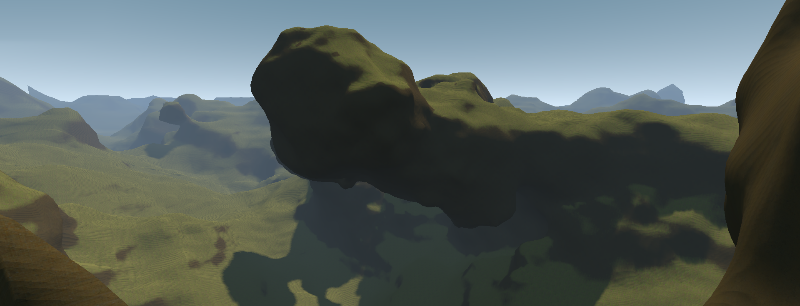

Voxel Tools for Godot
=========================

A C++ module for creating volumetric worlds in Godot Engine.

[](https://github.com/Zylann/godot_voxel/actions/workflows/windows.yml)
[](https://github.com/Zylann/godot_voxel/actions/workflows/linux.yml)
[](https://github.com/Zylann/godot_voxel/actions/workflows/mono.yml)

[](https://discord.gg/pkXmESmrAR)





Features
---------------------------

- Realtime 3D terrain editable in-game (Unlike a heightmap based terrain, this allows for overhangs, tunnels, and user creation/destruction)
- Godot physics integration + alternate fast Minecraft-like collisions
- Infinite terrains made by paging chunks in and out
- Voxel data is streamed from a variety of sources, which includes the ability to write your own generators
- Minecraft-style blocky voxel terrain, with multiple materials and baked ambient occlusion
- Smooth terrain with level of detail using Transvoxel
- Voxel storage using 8-bit or 16-bit channels for any general purpose
- Instancing system to spawn foliage, rocks and other decoration on surfaces

Check the [changelog](https://voxel-tools.readthedocs.io/en/latest/changelog/) for more recent details.


Documentation
---------------

- [Main documentation](https://voxel-tools.readthedocs.io/en/latest/)
- [How to get the module](https://voxel-tools.readthedocs.io/en/latest/getting_the_module/)
- [Quick start](https://voxel-tools.readthedocs.io/en/latest/quick_start/)


Roadmap
---------

These are some ideas that may or may not be implemented in the future:

* Texturing on smooth terrain
* Editor preview and authoring
* Improving LOD performance
* Other meshing algorithms (e.g. dual contouring)
* GPU offloading (Maybe when Godot 4+ supports compute shaders)
* Migrate to a GDNative plugin (post Godot 4, needs work)


Supporters
-----------

This module is a non-profit project developped by voluntary contributors. The following is the list of the current donors.
Thanks for your support :)

### Supporters

```
wacyym
Sergey Lapin (slapin)
Jonas (NoFr1ends)
lenis0012
Phyronnaz
RonanZe
furtherorbit
jp.owo.Manda (segfault-god)
hidemat
Jakub Buriánek (Buri)
```

